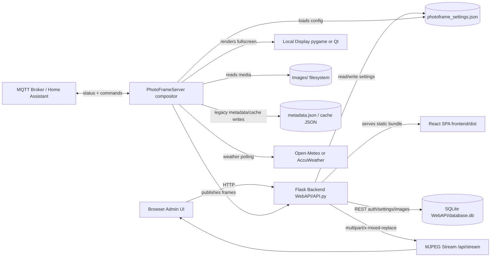

# 1. Executive Summary

DigitalPhotoFrame is a monolithic Python application that powers a local or embedded digital photo frame. It renders photo and video slideshows with animated transitions, overlays time/date and optional weather data, exposes a browser-based admin UI for configuration and gallery management, and can run either headless, in a lightweight `pygame` fullscreen mode, or in a legacy `PySide6` Qt fullscreen mode.

The primary audience is operators of a dedicated display device rather than end users of a multi-tenant web product. The repository is clearly optimized for Raspberry Pi deployments, hobbyist/self-hosted installs, and kiosk-style desktop setups where a single process owns display rendering, the HTTP API, and local device integrations such as brightness control, weather, MQTT, and auto-update behavior.

# 2. Tech Stack & Architecture

- **Frontend:** `frontend/` is a React 19 single-page application built with Vite 7 and plain CSS. Routing is handled by `react-router-dom`, API calls use `axios`, icons come from `lucide-react`, and state management is limited to React component state plus a small `AuthContext` (`frontend/src/context/AuthContext.jsx`). No Redux, Zustand, React Query, or CSS framework is present.
- **Backend:** The backend is Python and Flask-based. `WebAPI/API.py` creates the Flask app, serves the compiled frontend from `frontend/dist`, registers REST-style JSON blueprints under `/api/*`, and exposes the MJPEG stream at `/api/stream`. There is no GraphQL layer. The frame/render pipeline is implemented in-process in `FrameServer/PhotoFrameServer.py`, which shares state directly with Flask rather than communicating over a queue or separate service boundary.
- **Database & Storage:** Persistent data is split across SQLite and JSON files. `WebAPI/database.py` uses raw `sqlite3` and creates `users` and `images_metadata` tables in `WebAPI/database.db`. Settings live in `photoframe_settings.json`. Image files live under `Images/`, thumbnails are generated under `_thumbs/`, and weather/cache/state files are written as JSON in the repo root. There is no Redis, no ORM in use, and no object storage integration.
- **Infrastructure:** The repo includes a multi-stage Docker build (`Dockerfile`) that builds the React frontend with Node 20 and runs the Python app on `python:3.11-slim`. Deployment is either Docker Compose (`docker-compose.yml`, `docker-compose.pi.yml`) or a bare-metal systemd install script (`install_photoframe_service.sh`). Raspberry Pi-specific deployment assumptions are strong. Cloud provider integration is **Missing from Repo**.
- **Architecture Diagram:** High-level runtime architecture:



# 3. Core Features & Business Logic

- **Slideshow rendering engine:** `FrameServer/PhotoFrameServer.py` owns image/video selection, transition sequencing, frame pacing, overlay composition, and publication of live frames to both the local display and the Flask MJPEG streamer.
- **Transition/effects library:** `FrameServer/EffectHandler.py` and `FrameServer/Effects/` provide a plug-in-like collection of transition generators such as dissolve, wipe, zoom, iris, barn door, blinds, ripple-related variants, and cross-zoom style effects.
- **Image preparation and background styling:** `FrameServer/image_handler.py` handles resize, letterbox/fill behavior, translucent blurred backgrounds, and shadowing.
- **Overlay rendering:** `FrameServer/overlay.py` renders clock/date/weather overlays onto frames, including a “contrast text” mode that inverts sampled pixels under text instead of drawing a solid overlay color.
- **Browser admin UI:** The React SPA provides login/signup/reset-password pages plus authenticated dashboard views for live stream preview, gallery management, and settings editing (`frontend/src/pages/*`).
- **Image gallery ingestion:** `WebAPI/routes/images.py` supports image listing, upload, deletion, metadata retrieval/update, and thumbnail generation. HEIC/HEIF files are converted to PNG at upload time via `pillow-heif` when available.
- **Settings persistence and hot reload:** `Settings.py` provides a simple cached JSON settings handler. `WebAPI/routes/settings.py` persists settings updates, and `PhotoFrameServer.apply_settings_now()` hot-reloads selected runtime values without a full restart.
- **Authentication:** `WebAPI/routes/auth.py` implements signup, login, logout, session-backed `/me`, and password reset. User records live in SQLite via `WebAPI/database.py`.
- **Weather providers:** `Utilities/Weather/weather_adapter.py` selects between Open-Meteo and AccuWeather. Provider-specific implementations live in `Utilities/Weather/open_meteo_handler.py` and `Utilities/Weather/accuweather_handler.py`.
- **MQTT / Home Assistant:** `Utilities/MQTT/mqtt_bridge.py` publishes health and device state, exposes Home Assistant discovery entities, and accepts commands for brightness, update, restart, and service on/off control.
- **Auto-update:** `Utilities/autoupdate_utils.py` implements a tag-gated git updater with JSON config backup/restore and a fallback `git pull` path when semver tags are absent.

Key workflows:

1. **Application startup**
   `app.py` reads the settings JSON, selects a runtime mode (`--headless`, `--display pygame`, or `--display qt`), starts `PhotoFrameServer`, starts the Flask backend in a thread, and optionally attaches MQTT and auto-update loops.
2. **Authentication**
   The React app calls `/api/auth/login`, `/api/auth/signup`, `/api/auth/reset-password`, and `/api/auth/me`. Successful login rotates the Flask session and stores `uid`, `user`, and `role` in the session cookie.
3. **Media ingestion**
   Uploads hit `/api/images/upload`, files are written to the configured image directory, HEIC/HEIF files may be normalized to PNG, metadata is saved, and the frame server refreshes its in-memory media list.
4. **Playback/rendering**
   `PhotoFrameServer.run_photoframe()` shuffles the current media set, loads the next image or video, applies a transition generator, renders overlays, pushes the newest frame to the display adapter, and signals the backend to encode and publish JPEG frames at the configured cadence.
5. **Settings updates**
   The admin UI fetches `/api/settings/`, edits a subset of the JSON structure, and POSTs the entire updated object back. The backend saves JSON and triggers `notify_settings_changed()`, which attempts immediate in-process reload and otherwise defers reload to the main frame loop.
6. **Operational control**
   MQTT allows external systems to inspect health and request brightness changes, git update checks, or service restarts. Bare-metal and Docker installs also provide shell helper scripts for restart/update/logs.

Complex/custom logic worth special attention:

- **Transition pacing and compositor timing:** `FrameServer/PhotoFrameServer.py`
- **Overlay composition and contrast inversion:** `FrameServer/overlay.py`
- **Tag-based updater with config migration:** `Utilities/autoupdate_utils.py`
- **Home Assistant discovery/state publishing:** `Utilities/MQTT/mqtt_bridge.py`
- **Screen scheduling, brightness, and orientation:** `Utilities/screen_scheduler.py`, `Utilities/brightness.py`, `FrameGUI/helpers/hardware_manager.py`

# 4. Repository Structure

High-level directory layout:

```text
.
├── app.py
├── Settings.py
├── FrameServer/
├── FrameGUI/
├── WebAPI/
├── Utilities/
├── frontend/
├── Tests/
├── Dockerfile
├── docker-compose.yml
├── docker-compose.pi.yml
├── install_docker_kiosk.sh
├── install_photoframe_service.sh
├── photoframe_settings.example.json
├── README.md
├── deploy.md
└── DOCKER.md
```

Critical directories and files:

- `app.py`: Main entry point and mode selector. This is the top of the runtime dependency graph.
- `FrameServer/`: Core slideshow/compositor logic, effect generators, image transforms, and overlay rendering. This is the performance-sensitive hot path.
- `FrameGUI/`: Local display adapters and Qt settings UI. `photoframe_view_pygame.py` is the lightweight runtime display path; `photoframe_view_qt.py` is the richer/older PySide6 path.
- `WebAPI/`: Flask app, blueprints, authentication helpers, and SQLite access.
- `Utilities/`: Cross-cutting services such as auto-update, MQTT, weather, brightness, screen scheduling, and filesystem watching.
- `frontend/`: React/Vite admin client. The built artifact in `frontend/dist` is served by Flask in production mode.
- `Tests/`: Python unit tests. Coverage is currently narrow and focused on auto-update and MQTT watchdog behavior.

Architectural pattern:

- This is **not** a microservice architecture.
- It is a **single-process, module-oriented monolith** with shared in-memory state between the compositor, backend, and display layer.
- The frontend is a separately built SPA, but it is deployed as static assets inside the Python application rather than as an independently hosted service.
- There are signs of a migration from older server-rendered/Qt-heavy flows toward the current React SPA plus `pygame`-first deployment model. Both generations still coexist in the repo.

# 5. Local Setup & Development

Recommended local baseline for new developers:

- Python: **3.11 recommended**
  Notes: repo metadata is inconsistent. `pyproject.toml` says `>=3.8`, `deploy.md` says `3.9+`, CI runs `3.10` and `3.11`, Docker uses `3.11`, and `.python-version` is `3.13`.
- Node.js: **20 LTS recommended**
  Notes: `deploy.md` says `Node.js v18+`, while the Docker build uses `node:20-slim`.
- Optional: Docker Desktop / Docker Engine for containerized workflows
- Optional: `pygame` for local lightweight display mode
- Optional: display-specific tools (`wlr-randr`, `xrandr`) if testing brightness/orientation on Linux

Step-by-step local setup:

1. Create or reuse the project virtual environment:
   ```bash
   python -m venv env
   ```
2. Install Python dependencies into the repo venv:
   ```bash
   env/bin/pip install -e . pytest ruff
   ```
3. Create a working settings file:
   ```bash
   cp photoframe_settings.example.json photoframe_settings.json
   ```
4. Create the media directory if it does not already exist:
   ```bash
   mkdir -p Images
   ```
5. Install frontend dependencies:
   ```bash
   cd frontend
   npm install
   ```
6. Build the frontend bundle that Flask serves:
   ```bash
   npm run build
   cd ..
   ```
7. Start the application:
   ```bash
   env/bin/python app.py --headless
   ```
   Alternate modes:
   ```bash
   env/bin/python app.py --display qt
   env/bin/python app.py --display pygame
   ```
8. Open the app:
   - Admin UI: `http://localhost:5002/` by default
   - MJPEG stream: `http://localhost:5002/api/stream`
   - Remote frame view: `http://localhost:5002/frame`

Environment/configuration notes:

- No `.env.example` file was found. Environment variable usage is present but lightly documented.
- `PHOTOFRAME_SECRET_KEY`: optional Flask session secret override; used by `WebAPI/API.py`
- `PHOTOFRAME_PORT`: Docker Compose port mapping only
- `APP_DIR`, `FRAME_USER`: installer-script variables for `install_docker_kiosk.sh`
- `WAYLAND_DISPLAY`, `XDG_RUNTIME_DIR`, `DISPLAY`, `QT_QPA_PLATFORM`, `SDL_VIDEODRIVER`: display/runtime variables used in Pi/Linux deployment flows

Database/migrations:

- There is **no formal migration command** in the repo.
- SQLite initialization happens automatically in `WebAPI/database.py:init_db()`.
- Legacy `users.json` and `metadata.json` migration also happens automatically on startup if the SQLite tables are empty.

Frontend development caveat:

- `frontend/vite.config.js` does **not** define a dev proxy for `/api`.
- That means `npm run dev` is useful for UI-only iteration, but it does not currently proxy API traffic to Flask despite `DOCKER.md` implying that behavior.
- In practice, the most reliable local workflow is to build the SPA and let Flask serve `frontend/dist`.

Docker workflow:

```bash
docker compose up --build
```

Pi-specific overlay:

```bash
docker compose -f docker-compose.yml -f docker-compose.pi.yml up -d
```

# 6. Testing & CI/CD

Testing strategy currently present in the repo:

- **Python unit tests:** Limited coverage in `Tests/`
  - `Tests/test_autoupdate.py`
  - `Tests/test_mqtt_watchdog.py`
- **Frontend tests:** **Missing from Repo**
- **Backend/API integration tests:** **Missing from Repo**
- **End-to-end/browser tests:** **Missing from Repo**
- **Performance/load tests:** **Missing from Repo**

Useful local verification commands:

```bash
env/bin/python -m pytest
env/bin/python -m ruff check .
cd frontend && npm run lint
cd frontend && npm run build
```

Observed verification results from the current workspace:

- `env/bin/python -m pytest`: failed because `pytest` is not installed in the current repo `env/`
- `env/bin/python -m ruff check .`: failed because `ruff` is not installed in the current repo `env/`
- `cd frontend && npm run lint`: fails with 2 ESLint errors in `frontend/src/context/AuthContext.jsx`
- `cd frontend && npm run build`: passes successfully

CI/CD status:

- GitHub Actions workflow found: `.github/workflows/tests.yml`
- Trigger: pushes and pull requests targeting `main`
- Matrix: Python `3.10` and `3.11`
- Actions performed:
  - checkout
  - install Python
  - install `libgl1-mesa-glx`
  - `pip install -e .`
  - `pip install ruff pytest`
  - `ruff check .`
  - `pytest`

What CI/CD does **not** currently do:

- No frontend lint/build in CI
- No Docker build validation in CI
- No deployment automation
- No release workflow
- No environment promotion strategy
- No secrets-management workflow
- No artifact publishing

Deployment pipeline summary:

- Bare-metal deployment is handled by shell scripts and systemd.
- Container deployment is handled by Docker Compose and a Pi-specific installer script.
- Hosted/cloud deployment pipeline is **Missing from Repo**.

# 7. Current State, Known Issues, & Tech Debt

The repository is functional and thoughtfully ambitious, but it is carrying a noticeable amount of transition-era complexity. The biggest theme is that the project currently spans multiple generations of architecture at once: a React SPA, older Flask template/static assets, a Qt settings UI, a newer `pygame` display path, SQLite persistence, and older JSON persistence patterns.

Highest-priority issues:

- **Authentication/security gaps**
  - `WebAPI/routes/auth.py` resets passwords by email address alone, with no reset token, email verification, or prior authentication.
  - `WebAPI/API.py` creates CSRF helpers, but mutation routes are not actually enforcing them.
  - Flask session cookies are configured with `SESSION_COOKIE_SECURE=False`.
  - The settings examples and code still rely on placeholder/default secret-key values.
- **Split persistence model**
  - `WebAPI/database.py` stores users and image metadata in SQLite.
  - `FrameServer/PhotoFrameServer.py` still writes image metadata to `metadata.json`.
  - The runtime slideshow path updates JSON while API routes read SQLite, so `views`, `last_displayed`, and related metadata can drift across stores.
- **Tracked runtime/developer state**
  - `WebAPI/database.db`, `metadata.json`, `openmeteo_weather_cache.json`, and `photoframe_settings.json` are tracked in git.
  - These files represent generated/runtime state and include machine-specific or environment-specific data.
  - `metadata.json` in particular contains absolute host paths, which hurts portability.
- **Dependency/runtime inconsistency**
  - Python version expectations differ across `.python-version`, `pyproject.toml`, `deploy.md`, CI, and Docker.
  - `pyproject.toml` and `requirements.txt` do not agree on the full dependency set.
  - Some dependencies are present but unused (`SQLAlchemy`, `pandas`), while some runtime imports appear only in one dependency source.
  - The repo `env/` does not currently match the documented developer bootstrap assumptions.

Important product/engineering gaps:

- **Frontend and backend settings are partially out of sync**
  - `frontend/src/pages/SettingsView.jsx` edits `weather_api_key` and `location_key`, but `Utilities/Weather/weather_adapter.py` expects `accuweather_api_key` and `accuweather_location_key`.
  - Signup/reset-password pages accept 8-character passwords, but the backend requires 10+ characters and 3 character classes.
- **Legacy assets still present**
  - `WebAPI/templates/` and `WebAPI/static/` look like remnants of an older server-rendered UI path.
  - `render_template` is imported in `WebAPI/API.py`, but current routing serves the React SPA from `frontend/dist`.
- **File observer extension mismatch**
  - `Utilities/observer.py` watches only a subset of the extensions the app otherwise supports.
  - New HEIC/HEIF/WebP/video files may not trigger reload behavior consistently.
- **Unsafe file handling**
  - `WebAPI/routes/images.py` deletes files by joining a user-supplied path directly under `IMAGE_DIR`, with weaker safety checks than the thumbnail route.
  - Uploads reuse the original filename and do not handle collisions or normalization robustly.
- **Monolithic backend module**
  - `WebAPI/API.py` is doing app bootstrap, streaming, storage setup, thumbnailing, HEIC normalization, auth/session utilities, and route registration in one large module.
- **Code duplication / cleanup debt**
  - `FrameServer/image_handler.py` contains duplicated logic after an early `return`.
  - `WebAPI/API.py` contains repeated imports and mixed concerns.
  - `logging_setup.py`, `config.py`, and some legacy JSON helpers appear only partially integrated.

Missing essential pieces:

- No formal database migration/versioning system
- No frontend test suite
- No API integration/e2e suite
- No production WSGI/ASGI server configuration
- No deployment secrets strategy in-repo
- No frontend CI checks
- No Docker/image CI checks
- No cloud deployment description

Recommended priorities for the incoming team:

1. **Close security holes first**
   - Replace the current password-reset flow with a token-based or admin-only mechanism.
   - Enforce CSRF on mutating session-backed routes.
   - Standardize secret handling and stop relying on fallback/default keys.
2. **Unify persistence**
   - Pick SQLite or JSON for metadata, not both.
   - Remove legacy dual-write behavior from `PhotoFrameServer`.
   - Stop tracking generated DB/cache/state artifacts in git.
3. **Standardize the runtime contract**
   - Decide on the supported Python and Node versions.
   - Consolidate dependencies so `pyproject.toml`, `requirements.txt`, Docker, and CI all agree.
4. **Stabilize the frontend/backend API contract**
   - Fix settings-key mismatches.
   - Fix password-policy mismatches.
   - Add a Vite dev proxy or document the supported local workflow more explicitly.
5. **Reduce architectural ambiguity**
   - Decide whether the supported UI path is React + Flask + `pygame`, or whether the older template/Qt flows still matter.
   - Remove or quarantine dead/legacy code once that decision is made.
6. **Invest in test coverage**
   - Add API integration tests around auth, settings, uploads, and metadata.
   - Add frontend smoke tests for login, gallery, and settings.
   - Add at least one headless compositor smoke test.
